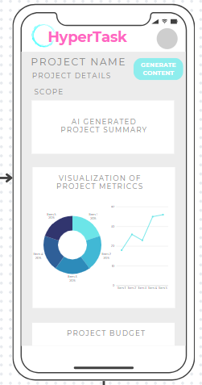

# HyperTask

## Overview

HyperTask offers automated project managaement capabilities to users. The backend is powered by AI and the user can have one or multiple projects. The setup of the site will be similar to other project management tools, however the tasks will be managed by AI to relive the user from some project management tasks. 

### Problem

HyperTask cuts project management time down so that more time can be spent on the design and development of projects. All project management tasks- resource allocaiton, project planning, setting deadlines, managing budgets - take time and effort. The goal of HyperTask is to automate and streamline these processes as much as possible. 

### User Profile

HyperTask offers automated project management capabiliteis to many differnet groups of people, however the target audience is freelance workers, or small buisnesses. Those with less experience with project management can benefit from the assistance provided by HyperTask. Hypertask could also be useful to smaller buisnesses to automate processes so that less time is spent on project planning, and more time can be dedicated to project development.

### Features

The main features of HyperTask for users include:
    - Personal user profile
    - Team/Group boards (where multiple users can edit one board)
    - AI powered Kanban board card creation (including points, title, task description)
    - Project timeline recommendations
    - Email generation as required for tasks
    - Action item extraction from emails or meeting minutes
    - Weekly summary/short report of perfromance metrics and project summary to date

## Implementation

### Tech Stack

- node.js
- Express
- React
 Client libraries: 
    - react
    - react-router
    - axios
    - chart.js
    - Socket.io
    - Autho
    - Spline

Server libraries:
    - knex
    - express
    - Socket.io
    - openai
    - TensorFlow (AI model to train) 

### APIs

- Open AI API (NLP for text generation through prompts)
- TensorFlow API (AI training for algorithms)

### Sitemap

Register/Login

Home Page - The home page is the first page the user sees when loading the page. The home page has some eye catching graphics and a get started button.

Get Started Page - This page is a form to get started with HyperTask. It provides two functions, the user authentication and basic information for the description of the users first project. 

Board Page - This will be the 'main page' once the user has logged in. The page will display the current active project board. This page will also have a side tab where other projects can be accessed (if they exist). The board page will also have the AI assist functionality and features as mentioned in the features section. If other team members have access to the board, those team members profiles will be visible. This page will rerender if another project is seelcted from the project list.

Project Details Page - There will be another page that users can navigate to for more in depth information about the active project. The users have access to more functionality on this page, including proejct summaries, visualizations, metrics, budgeting.

### Mockups

#### Home Page

#### Register Page

#### Login Page

#### Board Page

#### Details Page

#### User Flow

#### SQL Flow

### Data

The user login data will be stored in a 'users' table with mySQL/knex. HyperTask will also store the project id in the table which will point to whichever users have access. HyperTask will utilize the Open AI API and store the returned prompts/cards in the database.

### Endpoints

OPEN AI API REQUESTS - The prompts will be sent as a body from the frontend. The max tokens are assigned to determine the length of the response. One endpoints will be used, called the completions endpoint.

Exmaple post request: 

    POST('/create-card-content')
        await axios.post(https://api.openai.com/v1/chat/completions, {
            model: "gpt-3.5-turbo",
            messages: [{ role: 'user', content: prompt }],
            max_tokens: 150,
        }, {
        headers: {
        'Authorization': `Bearer ${openaiApiKey}`,
        'Content-Type': 'application/json',
        },
    });

    {
        This is the content of a card generated by the Open AI API. 
    }

The prompt will be created on the frontend. It will likely be a 'precoded' prompt where the user input values will change the main content of the prompt. 
For example,
prompt = "Write a list of 5 kanban card recommendations for ${userProject} where ${mainGoals}". 

API REQUESTS TO THE SERVER - The server will store certain data like kanban card content, user profiles, project summaries. The following HTTP requests will be used: 

    GET('/cards')
    Response: {
        card1: task content,
        card2: task content,
        card3: task content,
        card4: task content
    }

    GET('/project)
    Response: {
        project scope: //contentScope//,
        project metrics: //contentMetrics//,
        project budget: //contentBudget//,
        project recommendations: //contentRecommendations//
    }

    POST('/signup')
    Response: {
        Success: true
    }

    POST('/login')
    Response: {
        token : ///token///
    }

    GET('/profile')
    Response: {
        username: username,
        projects: [project1, project2, project3], 
    }

### Auth

The project will have two instances of authorization. The Open AI API requires that the user uses an authorization token to access the Api. The authorization 'Bearer' token is sent with the prompt each time the Open AI Api is called. 

Another form of authoirization will be used for the user to create an account so that their projects can be accessed.

## Roadmap

Sprint-1 - Aug 5 - Aug 12
- create client with boilerplate
    - create homepage with graphics and icons
    - client side Socket.io
- Create server with boilerplate 
    - create mitigations
- Server development of fetching Open AI API
- Server side Socket.io

Sprint-2 - Aug 13-Aug 20

- Feature: Register/Login 
    - Store form data in mySQL table
    - Create POST /signup, POST /login, and GET /profile endpoints
    
- Feature: Open AI generate card content 
    - Call Open AI with prompt to generate card data
    - Store card data in board table 
    - Create GET /cards endpoint 

- Feature: Open AI generate project details 
    - Call Open AI with prompt to generate project details
    - Create and store project details in project table
    - Create GET /project endpoint 

## Nice-to-haves

Ideally, the app will feature the capability to train an AI model using the TensorFlow API. With TensorFlow, the AI model can be trained to use AI algorithms to assign tasks based on team members' skills, availability, and current/future workload. TensorFlow could also be used for resource management. Another feature that would be nice to have is a scope of work/proposal generator that is trained by AI to learn from your writing style. 
